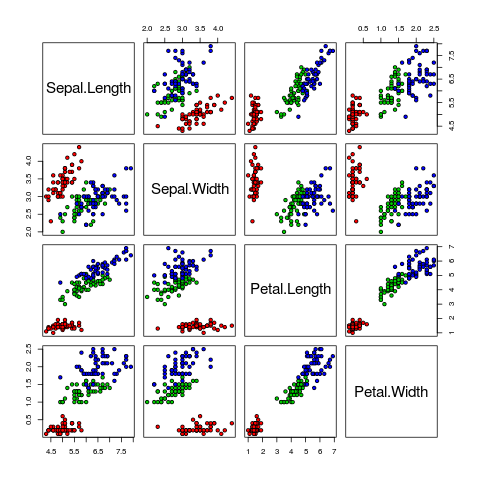

## Example MLI problem

### Problem name
Classification of iris dataset

### Problem Statement
Given the iris dataset, you need to train your model to predict to predict the Species of iris plant based on their sepal and petal details.

Note that the above problem statement is too short and does not explain the problem in detail. It's provided for sample purpose only.

#### Training dataset
file: `/data/training/iris_train.csv`
##### Columns
Sepal.Length  
Sepal.Width  
Petal.Length  
Petal.Width  
Species  

### Output format
You need to write a csv file `/code/iris_prediction.csv` with the following data.
The file line should have the column names `id` and `Species`.
Next `n` lines should contain predicted values of Species for each `id` in the test data.

#### Example
```
id,Species
3,setosa
8,setosa
```

### Datasets

#### Training dataset
This dataset will be publicly available to the user. He can also download it.
[Download training dataset](../assets/doc/iris_train.zip)

#### Test dataset
This dataset will not be publicly available to the user. It will be available in the evaluation environment only.
[Download test dataset](../assets/doc/iris_test.zip)

### Solution
```R
library(caret)
library(klaR)

data_train = read.csv("/data/training/iris_train.csv")
data_test = read.csv("/data/test/iris_test.csv")

# User can save any number of plots to `/code/output` directory
# This will be visible in the reports
png(filename = "/code/output/pairs.png")
pairs(iris[1:4], pch = 21, bg = c("red", "green3", "blue")[unclass(iris$Species)])
dev.off()

model = NaiveBayes(Species~., data = data_train)

predictions = predict(model, data_test)
data_test$Species = predictions$class

write.csv(data_test[,c("id","Species")],file = "/code/iris_prediction.csv",quote = FALSE,row.names = FALSE)

```

### Generated plots


### Testcases

Note that plots can be generated by the evaluation script also.
```R
library(caret)
library(klaR)

data_train = read.csv("/data/training/iris_train.csv")
data_test = read.csv("/code/iris_prediction.csv") # File generated by the user
data_actual = read.csv("/data/test/iris_actual.csv") # Contains the actual values for Species in test data

model = NaiveBayes(Species~., data = data_train)

predictions = predict(model, data_test)
data_test$Species = predictions$class

final = merge(data_test, data_actual, by = "id")
# Exit if output file does not contain the expected data
stopifnot(nrow(final) == nrow(data_actual))

cm = as.matrix(table(Actual = final$Species.y, Predicted = final$Species.x))
n = sum(cm)
diag = diag(cm)
accuracy = sum(diag) / n
write(c("accuracy", accuracy),file = "/code/errormetrics",ncolumns = 2) # This is required to show the error metrics value to the user
# Return exit code 1 if accuracy is less
stopifnot(accuracy > 0.7)

```
