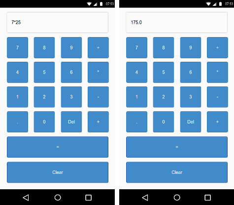

## Sample Android Problem

### Name

Temperature Converter

### Description

Create a simple Calculator app with the following specifications.
```
Activity name should be 'MainActivity'
EditText field, where the expression and the final answer is displayed, should have the id 'text'
Each of the Buttons should have the following id's0 : zero
1 : one
2 : two
3 : three
4 : four
5 : five
6 : six
7 : seven
8 : eight
9 : nine
. : point
Del : delete // deletes the last entered value
÷ : divide
* : multiply
- : subtract
+ : add
= : equal // computes the final value of the
          // expression and updates the EditText field.
          // At least one decimal place should be
          // displayed
Clear : clear // clears the expression in the
              // EditText field
```


#### Note
- If you want to build the app using your local IDE, please download the default android source code and make your changes in it.
- The package name should be 'com.doselect.androidapp'
- Do not modify 'build.gradle', 'app/build.gradle', 'gradle.properties' and 'settings.gradle'. These are provided for local testing only. These configurations are used while building the app on our servers.
- The maximum number of submissions is 5. So make sure you take your time in checking your code before submitting.

### Mockup




### Testcases

```java
package com.doselect.androidapp;

import android.content.Context;
import android.content.DialogInterface;
import android.support.test.InstrumentationRegistry;
import android.support.test.espresso.core.deps.guava.base.Strings;
import android.support.test.rule.ActivityTestRule;
import android.support.test.runner.AndroidJUnit4;

import org.junit.Rule;
import org.junit.Test;
import org.junit.runner.RunWith;

import tools.fastlane.screengrab.Screengrab;

import static android.support.test.espresso.Espresso.onView;
import static android.support.test.espresso.action.ViewActions.click;
import static android.support.test.espresso.action.ViewActions.closeSoftKeyboard;
import static android.support.test.espresso.action.ViewActions.typeText;
import static android.support.test.espresso.assertion.ViewAssertions.doesNotExist;
import static android.support.test.espresso.assertion.ViewAssertions.matches;
import static android.support.test.espresso.matcher.ViewMatchers.isDisplayed;
import static android.support.test.espresso.matcher.ViewMatchers.withId;
import static android.support.test.espresso.matcher.ViewMatchers.withText;
import static org.junit.Assert.*;

/**
 * Instrumentation test, which will execute on an Android device.
 *
 * @see <a href="http://d.android.com/tools/testing">Testing documentation</a>
 */
@RunWith(AndroidJUnit4.class)
public class ApplicationTest {

    public static final String FIRST_ANSWER = "8.0";
    public static final String SECOND_ANSWER = "-1.0";

    @Rule
    public ActivityTestRule<MainActivity> mActivityRule = new ActivityTestRule<MainActivity>(MainActivity.class);

    @Test
    public void useAppContext() throws Exception {
        // Context of the app under test.
        Context appContext = InstrumentationRegistry.getTargetContext();

        assertEquals("com.doselect.androidapp", appContext.getPackageName());

    }

    @Test
    public void testCalculator() throws Exception {

        onView(withId(R.id.text)).check(matches(isDisplayed()));
        onView(withId(R.id.zero)).check(matches(isDisplayed()));
        onView(withId(R.id.one)).check(matches(isDisplayed()));
        onView(withId(R.id.two)).check(matches(isDisplayed()));
        onView(withId(R.id.three)).check(matches(isDisplayed()));
        onView(withId(R.id.four)).check(matches(isDisplayed()));
        onView(withId(R.id.five)).check(matches(isDisplayed()));
        onView(withId(R.id.six)).check(matches(isDisplayed()));
        onView(withId(R.id.seven)).check(matches(isDisplayed()));
        onView(withId(R.id.eight)).check(matches(isDisplayed()));
        onView(withId(R.id.nine)).check(matches(isDisplayed()));
        onView(withId(R.id.point)).check(matches(isDisplayed()));
        onView(withId(R.id.delete)).check(matches(isDisplayed()));
        onView(withId(R.id.equal)).check(matches(isDisplayed()));
        onView(withId(R.id.clear)).check(matches(isDisplayed()));
        onView(withId(R.id.divide)).check(matches(isDisplayed()));
        onView(withId(R.id.multiply)).check(matches(isDisplayed()));
        onView(withId(R.id.subtract)).check(matches(isDisplayed()));
        onView(withId(R.id.add)).check(matches(isDisplayed()));

        Screengrab.screenshot("1");

        onView(withId(R.id.two)).perform(click());
        Screengrab.screenshot("2");
        onView(withId(R.id.multiply)).perform(click());
        Screengrab.screenshot("3");
        onView(withId(R.id.four)).perform(click());
        Screengrab.screenshot("4");
        onView(withId(R.id.equal)).perform(click());
        Screengrab.screenshot("5");
        onView(withId(R.id.text)).check(matches(withText(FIRST_ANSWER)));

        onView(withId(R.id.clear)).perform(click());
        Screengrab.screenshot("6");
        onView(withId(R.id.five)).perform(click());
        Screengrab.screenshot("7");
        onView(withId(R.id.subtract)).perform(click());
        Screengrab.screenshot("8");
        onView(withId(R.id.six)).perform(click());
        Screengrab.screenshot("9");
        onView(withId(R.id.equal)).perform(click());
        Screengrab.screenshot("10");
        onView(withId(R.id.text)).check(matches(withText(SECOND_ANSWER)));

    }
}


```
