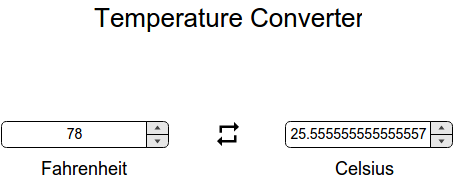

## Sample UIX Problem

### Name

Temperature Converter

### Description

Create a single page app to convert temperature from Fahrenheit scale to Celsius scale and vice versa.

Please stick to the following specifications (otherwise your evaluation will fail).
- Input fields should be of type 'number'
- Input field for Fahrenheit should have the id 'fahrenheit'
- Input field for Celsius should have the id 'celsius'
- Conversion should happen instantaneously i.e changing the value in one of the input fields should trigger the change in the other.

### Mockup



### Testcases

```javascript

var webdriver = require('selenium-webdriver'),
    chrome    = require('selenium-webdriver/chrome')
    By        = webdriver.By,
    until     = webdriver.until,
    options   = new chrome.Options();
    options.addArguments('headless'); // note: without dashes
    options.addArguments('disable-gpu')
    options.addArguments('no-sandbox')
var path = '/opt/chromedriver';
var service = new chrome.ServiceBuilder(path).build();
    chrome.setDefaultService(service);
var driver = new webdriver.Builder()
    .forBrowser('chrome')
    .withCapabilities(webdriver.Capabilities.chrome()) 
    .setChromeOptions(options)                         // note this
    .build();
var expect = require('chai').expect

describe('App', function() {
  describe('default page', function() {
    it('fahrenheit to celsius', function(done) {
      this.timeout(10000)
      driver.get(process.env.uix_url)
      element = driver.findElement(webdriver.By.id('fahrenheit'))
      element.sendKeys('89')
      ele = driver.findElement(webdriver.By.id('celsius'))
      ele.getAttribute('value').then(val => {
        expect(val).to.be.within(31,32)
        done()
      })
    })

    it('celsius to fahrenheit', function(done) {
      this.timeout(10000)
      driver.get(process.env.uix_url)
      element = driver.findElement(webdriver.By.id('celsius'))
      element.sendKeys('-101')
      ele = driver.findElement(webdriver.By.id('fahrenheit'))
      ele.getAttribute('value').then(val => {
        expect(val).to.be.within(-150,-149)
        done()
      })
    })

  })
})

```
